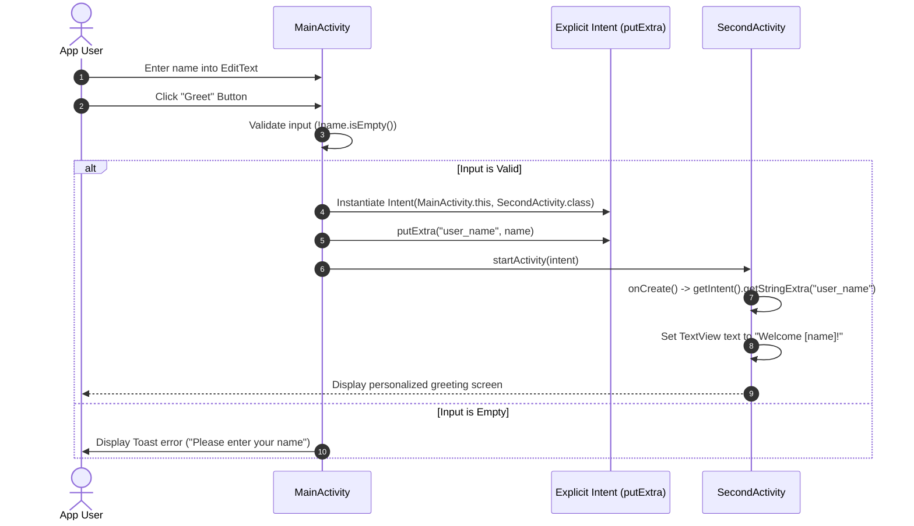

# Android Java Activity Lifecycle & Intent Navigation

[](https://developer.android.com)
[](https://www.oracle.com/java/)
[](https://developer.android.com/guide/components/intents-filters)
[](https://material.io)
[](LICENSE)

> A foundational Android development starter in Java demonstrating core Activity lifecycle management, Explicit Intent navigation, bundle payload transfer with `putExtra`, and user event handling.

---

## 📖 Overview

The **Java-Classes** project demonstrates the foundational building blocks of native Android development using **Java**. Designed as a clean reference for Android application architecture, it illustrates how Android activities operate, how inter-component communication is achieved via the Android Intent messaging framework, and how data is transferred across screens safely.

### 🎯 Key Learning Objectives
- **Activity Lifecycle & Declarative Layout Binding**: Understanding `onCreate(Bundle savedInstanceState)` and `setContentView()`.
- **Explicit Intent Routing**: Transitioning between distinct application activities using explicit class references (`new Intent(MainActivity.this, SecondActivity.class)`).
- **Cross-Activity Data Passing**: Packing primitive and string payloads into Intent Extras (`intent.putExtra(key, value)`) and extracting them in receiver activities (`getIntent().getStringExtra(key)`).
- **User Input Validation & Event Handling**: Handling button click events with Java 8 lambdas (`v -> { ... }`), managing input state, and presenting Android Toast notifications.
- **Modern SDK Compatibility**: Configured for Android 15 / SDK 36 using AndroidX AppCompat and ConstraintLayout.

---

## 🏗️ Architecture & Component Flow



---

## ✨ Core Concepts & Code Walkthrough

### 1. Explicit Intent Creation with Extras Payload
In `MainActivity.java`, user input is verified and packaged into an explicit intent before launching the destination activity:
```java
public class MainActivity extends AppCompatActivity {

    @Override
    protected void onCreate(Bundle savedInstanceState) {
        super.onCreate(savedInstanceState);
        setContentView(R.layout.activity_main);

        EditText editTextName = findViewById(R.id.etName);
        Button buttonGreet = findViewById(R.id.buttonGreet);
        TextView textViewGreets = findViewById(R.id.tvGreets);

        buttonGreet.setOnClickListener(v -> {
            String name = editTextName.getText().toString().trim();

            if (!name.isEmpty()) {
                textViewGreets.setText("Hello " + name + "!");

                Intent intent = new Intent(MainActivity.this, SecondActivity.class);
                intent.putExtra("user_name", name);
                startActivity(intent);
            } else {
                textViewGreets.setText("Please enter your name");
                Toast.makeText(this, "Please enter your name", Toast.LENGTH_SHORT).show();
            }
        });
    }
}
```

### 2. Intent Payload Extraction
In `SecondActivity.java`, the receiving activity extracts the data payload from the launching intent during its `onCreate` lifecycle hook:
```java
public class SecondActivity extends AppCompatActivity {

    @Override
    protected void onCreate(Bundle savedInstanceState) {
        super.onCreate(savedInstanceState);
        setContentView(R.layout.activity_second);

        TextView textViewRecieved = findViewById(R.id.tvRecieved);
        String nameReceived = getIntent().getStringExtra("user_name");

        textViewRecieved.setText("Welcome " + nameReceived + "!");
    }
}
```

---

## 📱 Project Structure

```
Java-Classes/
├── app/
│   ├── src/main/java/com/example/javaclasses/
│   │   ├── MainActivity.java              # Primary launcher Activity with input validation
│   │   └── SecondActivity.java            # Receiver Activity displaying unpacked data
│   ├── src/main/res/
│   │   ├── layout/
│   │   │   ├── activity_main.xml          # Input form with ConstraintLayout
│   │   │   └── activity_second.xml        # Display layout with TextView
│   │   └── values/                        # Colors, styles, and strings
│   ├── src/main/AndroidManifest.xml       # Activity declarations & intent filters
│   └── build.gradle.kts                   # Java 11 compilation, SDK 36 configuration
└── gradle/
    └── libs.versions.toml                 # Version catalog
```

---

## 🛠️ Technology Stack Matrix

| Component | Technology | Version / Details |
|---|---|---|
| **Platform** | Android | API 24+ (Compile & Target SDK 36) |
| **Language** | Java | Java 11 (`JavaVersion.VERSION_11`) |
| **Components** | Android Activities & Intents | `android.content.Intent`, `AppCompatActivity` |
| **UI Layout** | Android ConstraintLayout | `androidx.constraintlayout:constraintlayout` |
| **Design** | Material Design Components | `com.google.android.material:material` |
| **Build System** | Gradle (Kotlin DSL) | AGP 8.8+ |

---

## 🚀 Getting Started

### Prerequisites
- **Android Studio Ladybug (2024.2.1+)** or newer.
- **JDK 11 or JDK 17**.
- **Android SDK 36**.

### Build & Run
1. **Clone the repository**:
   ```bash
   git clone https://github.com/shayann07/Java-Classes.git
   cd Java-Classes
   ```
2. **Open in Android Studio**: Open the folder and allow Gradle sync to complete.
3. **Assemble Debug Build**:
   ```bash
   ./gradlew assembleDebug
   ```
4. **Run on Device**: Launch via Android Studio or command line onto an active emulator or physical test device.

---

## 📄 License

This project is licensed under the [MIT License](LICENSE) — Copyright (c) 2026 [shayann07](https://github.com/shayann07).
